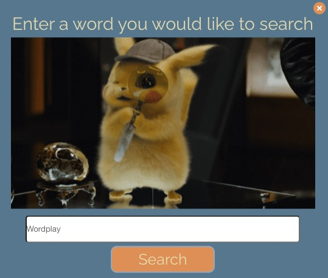

# Word-Play

## Description
This application allows you to search a word and returns the definition and four GIFs for that word.

## Technologies
HTML, CSS, Bulma, Javascript, GIPHY API, and Words API

## Repository
https://github.com/Jlvstrasse/word_play

## Usage
Enter a word into the search bar for the application to give you the information. Example below:

## License
MIT License

## Credits
Michael Daleo, Jose Gomez-Martinez, and Jessica Vorderstrasse

## Documentation
We used https://api.giphy.com for the GIPHY API. 
We used https://wordsapiv1.p.rapidapi.com for the Words API.

## Deployed Application